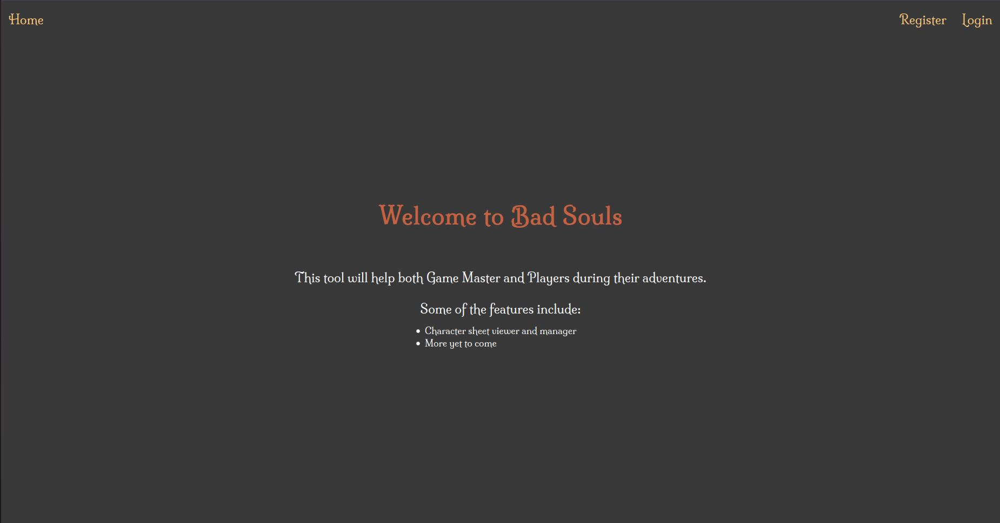

<h1 align="center">
    Bad Souls
</h1>

<p align="center">
  
  
  <a href="https://github.com/pedroccrp/badsouls/commits/master">
    
  </a>

  <a href="https://github.com/pedroccrp/badsouls/issues">
    
  </a>

  <a href="https://github.com/pedroccrp/badsouls/blob/master/LICENSE">
    
  </a>
</p>

<p align="center">
  <a href="#rocket-built-with">Built with</a>&nbsp;&nbsp;&nbsp;|&nbsp;&nbsp;&nbsp;
  <a href="#-about-the-project">About the project</a>&nbsp;&nbsp;&nbsp;|&nbsp;&nbsp;&nbsp;
  <a href="#-how-to-contribute">How to contribute</a>&nbsp;&nbsp;&nbsp;|&nbsp;&nbsp;&nbsp;
  <a href="#-project-structure">Project structure</a>&nbsp;&nbsp;&nbsp;|&nbsp;&nbsp;&nbsp;
  <a href="#memo-license">License</a>
</p>

<br>

<p align="center">
  
</p>

## :rocket: Built with

This project was made using:

- [Node.js](https://nodejs.org/en/)
- [React](https://reactjs.org)

## 💻 About the project

Tool made to help both Game Master and Players during their adventures using the Bad Souls RPG system (link to system yet to come).

## ⚙ How to use

- Start frontend server
  ```
  cd web

  yarn install
  yarn start
  ```

- Start backend server (still using development one)
  ```
  cd server

  yarn install --dev

  # Create and fill .env
  cp src/.env.example src/.env

  yarn dev
  ```

## 🤔 How to contribute

- Fork this repository;
- Create a branch with your feature: `git checkout -b my-feature`;
- Commit your changes: `git commit -m 'feat: My new feature'`;
- Push to your branch: `git push origin my-feature`.

After your pull request has been merged, you can delete your branch.

## :memo: License

This project is under the MIT license. See [LICENSE](LICENSE) for more details.
